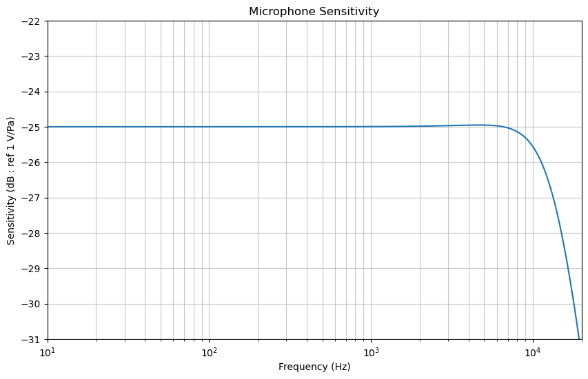
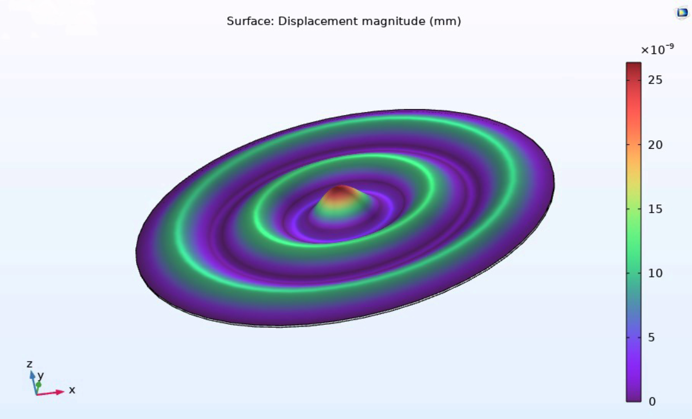

# 🎙️ Electrostatic Microphone Design


This project presents the design, analysis, and modelling of an **electrostatic microphone capsule**. The microphone is tailored for omnidirectional speech recording with high sensitivity and clarity across the 20 Hz to 10 kHz range.

---

## 🎙 Project Overview

Electrostatic microphones operate using a capacitor structure formed by a thin, tensioned diaphragm and a rigid backplate. This project focuses on optimising:

- Diaphragm material and tension for high-frequency response
- Backplate geometry for sensitivity
- Acoustic circuit modelling using lumped parameters
- Conversion of acoustic pressure to voltage (sensitivity)
- Design extension for **hyper-cardioid** directionality

---

🧮 Analytical Calculations

All analytical computations are performed using Python based on standard electroacoustic formulas. Here's a breakdown of major formulas and results:

## 🪶 1. Diaphragm Design

- **Mass per Unit Area:**  
```math
\mu = \rho_Q \times d
```

- **Resonance Frequency:**  
```math
f_0 = \frac{2.4}{2\pi a^2} \sqrt{\frac{\sigma_0}{\mu}} = 13973.52 \, \text{Hz}
```

- **Diaphragm Mass:**  
```math
M_M = \frac{4}{3} S \mu = 5.01 \, \mu g
```

---

## 🎧 2. Sensitivity

- **Stiffness-Controlled Sensitivity:**  
```math
S \approx \frac{E_0}{s} \cdot \frac{a^2}{8\sigma_0} = 0.05625 \, \text{V/Pa}
```

- **Sensitivity in dB:**  
```math
S_{dB} = 20 \log_{10}(S) = -25 \, \text{dB (ref 1 V/Pa)}
```
### ⚙️ Microphone Sensitivity

|  |
|:--:|
| *Figure: Frequency response of the microphone showing sensitivity (in dB re 1 V/Pa).* |

---

## 🧲 3. Capacitance and Polarisation

- **Capacitance:**  
```math
C_0 = \frac{\varepsilon_0 S}{s} = 10 \, \text{pF}
```

- **Time Constant:**  
```math
\tau = \frac{1}{f_l} = 0.5 \, \text{s}
```

- **Polarisation Resistance:**  
```math
R_p = \frac{\tau}{C} = 5 \, \text{G}\Omega
```

---

## 📦 4. Capsule Volume

- **Capsule Volume:**  
```math
V = \pi a^2 l = 5.089 \times 10^{-8} \, m^3
```

---

## 🌬️ 5. Acoustic Circuit

- **Acoustic Compliance:**  
```math
C_A = \frac{V}{\rho_0 c_0^2} = 3.67 \times 10^{-13} \, \text{m}^5/\text{N}
```

- **Acoustic Resistance:**  
```math
R_A = \frac{12 \eta_0 l}{s^3 w} = 6.75 \times 10^6 \, \text{Ns/m}^5
```

- **Low Frequency Cutoff:**  
```math
f_l = \frac{1}{2\pi C_A R_A} = 0.64 \, \text{Hz}
```

---

## 🧮 6. Sensitivity Transfer Function

- **Acoustic-to-Mechanical Displacement:**  
```math
\frac{\Xi_D(\omega)}{P_D(\omega)} = \frac{S}{j\omega R_M + K_M - \omega^2 M_M}
```

- **Mechanical-to-Electrical Voltage:**  
```math
v_o(\omega) = -\frac{E_0}{s} \Xi_D(\omega)
```

- **Overall Sensitivity Function:**  
```math
\frac{v_o(\omega)}{P_D(\omega)} = \frac{E_0 S}{s(j\omega R_M + K_M - \omega^2 M_M)}
```

| Diaphragm Displacement |
|------------------------|
</div>
<p align="center">
  
  <br/><i>Peak displacement observed near resonant frequency</i>
</p>

## 📐 Technical Summary

| Component               | Description                               |
|-------------------------|-------------------------------------------|
| **Microphone Type**     | Capacitor-based Electrostatic Microphone  |
| **Diaphragm**           | Beryllium (8 µm, 9 mm radius)             |
| **Backplate**           | Machined Aluminium                        |
| **Polarisation Voltage**| 200 V                                     |
| **Static Separation**   | 22.5 µm                                   |
| **Sensitivity**         | −25 dB (ref 1 V/Pa)                       |
| **Fundamental Frequency**| ~13.97 kHz                                |
| **Output Capacitance**  | ~10 pF                                    |
| **Time Constant**       | 0.5 s (using 5 GΩ resistor)               |
| **Estimated Cost**      | £40                                       |

---

## 🧮 Features & Analysis

### ✅ Analytical Model (Python)
- Lumped parameter model
- Diaphragm resonance frequency calculation
- Sensitivity vs frequency plot
- Acoustic and electrical domain interaction
- Frequency response shaped by:
  - Diaphragm tension
  - Backplate separation
  - Polarisation voltage

### ✅ Acoustic Circuit
- Lumped-element simulation of:
  - Diaphragm compliance
  - Air vent resistance and inertance
  - Capsule cavity compliance
- Extended for **hyper-cardioid** design with directional phase-shift venting

---

## 📊 Key Results

- **Sensitivity (Flat Response):** −25 dB V/Pa across 20 Hz – 10 kHz
- **High-Frequency Roll-Off:** Begins beyond 10 kHz due to diaphragm inertia
- **Low Cutoff Frequency:** ~0.64 Hz, enabling excellent low-frequency capture
- **Hyper-Cardioid Option:** Achieved via rear vent tuning and resistance control
